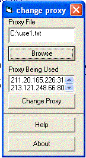



## Proxy Changer \(Privacy Preserver\)

### Description

Are u unhappy with your privacy over net ?   Then this thing is for u.    Proxy changer can change ur proxy server's address with a click of a button and thus mask ur I.P. address and keep u safe over net.    u can also use a fast proxy to increase ur surfing speed or download speed.    just give it a try and please do give some votes and feedbacks.    Thanks
 
### More Info
 

             |
---                |---
**Submitted On**   |2004-06-18 10:35:12
**By**             |[ManuMehrotra](https://github.com/Planet-Source-Code/PSCIndex/blob/master/ByAuthor/manumehrotra.md)
**Level**          |Intermediate
**User Rating**    |4.8 (53 globes from 11 users)
**Compatibility**  |VB 6\.0
**Category**       |[Complete Applications](https://github.com/Planet-Source-Code/PSCIndex/blob/master/ByCategory/complete-applications__1-27.md)
**World**          |[Visual Basic](https://github.com/Planet-Source-Code/PSCIndex/blob/master/ByWorld/visual-basic.md)
**Archive File**   |[Proxy\_Chan1758836182004\.zip](https://github.com/Planet-Source-Code/manumehrotra-proxy-changer-privacy-preserver__1-54456/archive/master.zip)

### Source Code

Are u unhappy with your privacy over net ?   Then this thing is for u.    Proxy changer can change ur proxy server's address with a click of a button and thus mask ur I.P. address and keep u safe over net.    u can also use a fast proxy to increase ur surfing speed or download speed.    just give it a try and please do give some votes and feedbacks.    Thanks

